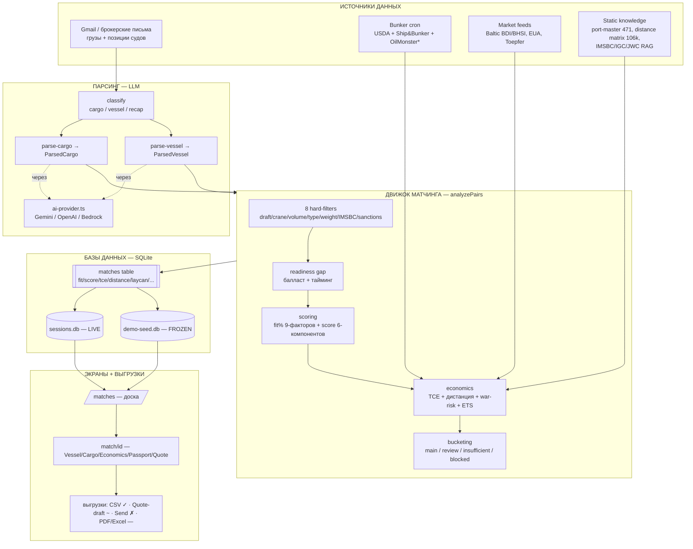

# Quantika Demo — карта системы (полное исследование)

> Составлено 2026-06-05 на основе 5 параллельных read-only разведчиков (parsing / DB+demo-modes / matching / economics+distance / UI+exports).
> Ветка чтения: `feat/bunker-oilmonster-med-blacksea`. ⚠️ Эта ветка ОТСТАЁТ от `main` по экономике (TCE) — см. §9.

---

## 0. Что это за система (одним абзацем)

Фрахтовый ассистент брокера. На вход — поток брокерских писем (предложения грузов + позиции судов).
LLM вытаскивает из писем структуру (что за груз, сколько тонн, откуда-куда, когда; какое судно, сколько
дедвейта, где открыто, скорость, расход). Детерминированный движок сопоставляет каждый груз с каждым судном,
отсеивает физически невозможное, считает экономику рейса (дневная доходность TCE, расстояние, топливо,
военный риск, углеродный сбор) и выдаёт брокеру отсортированную доску матчей с процентом «подходит» (fit%).

---

## 1. МАСТЕР-СХЕМА (поток данных)



ASCII-версия (для терминала):

```
ИСТОЧНИКИ                 ПАРСИНГ (LLM)          ДВИЖОК                    ХРАНИЛИЩЕ            ЭКРАНЫ
─────────                 ─────────────          ──────                    ─────────            ──────
Gmail письма ──┐          classify ─┐            analyzePairs:             ┌ sessions.db (live) ┌ /matches
(грузы+суда)   ├─ текст ─► parse-cargo ─ParsedCargo┐  8 hard-filters         │                    │   доска (fit/score/TCE)
               │          parse-vessel─ParsedVessel┤  readiness gap          │ matches table ◄────┤ /match/[id]
Bunker cron ───┤              │ ai-provider        ├► fit% (9) + score (6)   │ (сердце системы)   │   5 вкладок
Market feeds ──┤              │ Gemini/OpenAI/     │  economics (TCE)        │                    │ /cargo /vessels
port-master ───┘              ▼ Bedrock            │  bucketing ─────────────┤ demo-seed.db       └ выгрузки:
distance matrix          parsed_results table ◄────┘  main/review/insuf/block└ (frozen snapshot)     CSV✓ Quote~ Send✗
IMSBC/RAG
```

---

## 2. ИСТОЧНИКИ ДАННЫХ (откуда берутся данные)

| Источник                                    | Что даёт                                                                                      | Как попадает                                                             | Файл                                                                         |
| ------------------------------------------- | --------------------------------------------------------------------------------------------- | ------------------------------------------------------------------------ | ---------------------------------------------------------------------------- |
| **Брокерские письма (Gmail)**               | грузы + позиции судов (циркуляры)                                                             | live OAuth ИЛИ pre-export в `.private/etms-corpus.json`                  | `lib/corpus/loader.ts:19`, `build.ts:29`                                     |
| **Bunker prices** (цена топлива)            | $/тонна VLSFO по портам                                                                       | daily cron: USDA + Ship&Bunker scraper                                   | `scripts/knowledge/cron/refresh-bunker.ts`, `bunker-repository.ts:27`        |
| **OilMonster** (Istanbul/Piraeus/Constanta) | топливо для Восточного Средиземноморья/Чёрного моря                                           | ⚠️ ТОЛЬКО СПЕКА, адаптер не написан                                      | `docs/superpowers/specs/2026-06-02-oilmonster-bunker-med-blacksea-design.md` |
| **Market indices**                          | Baltic BDI/BHSI, EUA (углерод), Toepfer                                                       | admin CSV upload + cron → `market_indices`/`eua_prices`/`baltic_indices` | `/api/admin/market/upload-csv`                                               |
| **Static knowledge**                        | 471 порт (координаты, осадка, краны), матрица расстояний 106k пар, регуляторика IMSBC/IGC/JWC | в репо (JSON) + RAG-векторы в DB                                         | `data/ports/port-master.json`, `data/distances/searoute-pairs.json`          |

Письма всегда многократно пере-форвардятся → `unwrapForwardLayers()` снимает обёртки форвардов (`lib/corpus/forward-unwrap.ts`).

---

## 3. ПАРСИНГ (текст письма → структура)

**Поток:** письмо → `classify` (cargo/vessel/recap/other) → `parse-cargo` / `parse-vessel` → структурный объект → `parsed_results` table + session blob → триггер матчинга.

- **LLM-слой:** `lib/ai-provider.ts` (`callAiJson` / `callAiText`). Провайдер по цепочке `<SCOPE>_PROVIDER → AI_PROVIDER → openai`. Поддержка Gemini (Vertex), OpenAI, Bedrock. Для Gemini ОБЯЗАТЕЛЕН `responseSchema` (иначе ответ оборачивается в ` ```json ` и `JSON.parse` падает). Для Bedrock нельзя убирать `extractJson()` (Sonnet добавляет CoT-преамбулу).
- **Промпты:** `lib/prompts/parse-cargo.ts` (~530 строк), `parse-vessel.ts` (~560 строк). Схемы: `lib/schemas/parse-cargo.ts:73`, `parse-vessel.ts:87`.
- **Кэш переиспользования:** `parsed_results` (ключ account+gmail_id+parse_type) — только новые письма идут в LLM.

### ParsedCargo (что вытаскиваем из груза) — `lib/types.ts:169`

`originPort`/`destinationPort` (ConfidenceField), `cargoDescription`, `weightMt` (+ min/max), `cargoType` (BULK/BREAK_BULK/…), `laycan` (строка или {start,end}), `loadingRate`/`dischargeRate`, `freightRateUsd`, `stowageFactor`, `originPortAlternatives` (CHOPT), `missingInfo[]`.

### ParsedVessel (что вытаскиваем из судна) — `lib/types.ts:205`

`vesselName`, `imo`, `flag`, `built`, `dwtSummer`, `dwcc`, `draftMax`, `loa`/`beam`, `geared` (есть ли краны), `openPosition`/`openDate`, `speedLaden`/`speedBallast`, `consumption` (расход топлива), `lastCargoes` (история — для чистоты трюмов), `ciiRating`.

**Каждое поле несёт уровень уверенности** (`confirmed`/`interpreted`/`uncertain`) → множитель в скоринге (1.0/0.7/0.4).

---

## 4. БАЗЫ ДАННЫХ + ДВА ДЕМО

### 4.1 Инвентарь БД (всё — SQLite, одна схема, 44 миграции)

| DB                                            | Env-указатель                                      | Роль                                                                                      |
| --------------------------------------------- | -------------------------------------------------- | ----------------------------------------------------------------------------------------- |
| `data/sessions.db`                            | `SESSIONS_DB_PATH` (default)                       | LIVE: dev + non-demo prod. Все таблицы.                                                   |
| `data/demo-seed.db`                           | `SESSIONS_DB_PATH=data/demo-seed.db` (в DEMO_MODE) | FROZEN снимок: анонимизированные письма + parsed + matches. Шипается на прод через `scp`. |
| RAG-векторы (`imsbc/igc/jwc/bimco _vec/_fts`) | внутри sessions.db                                 | регуляторный поиск (RAG)                                                                  |
| market/bunker/eua/baltic таблицы              | внутри sessions.db                                 | рыночные данные                                                                           |

`sessions.db` и `demo-seed.db` **идентичны по схеме**, отличаются только содержимым.

### 4.2 Таблица `matches` (СЕРДЦЕ СИСТЕМЫ) — ключевые колонки

| Колонка                                                                       | Кто пишет                                                                 | Кто читает                  |
| ----------------------------------------------------------------------------- | ------------------------------------------------------------------------- | --------------------------- |
| `cargo_id`, `vessel_id`, `cargo_item_index`, `vessel_item_index`              | seed/engine                                                               | гидрация в нужный item      |
| `score` (0-100), `reason`                                                     | engine                                                                    | сортировка, тултип          |
| `fit_percent`, `fit_breakdown` (JSON)                                         | `computeFitBreakdown`                                                     | доска: сорт, цвет, разбивка |
| `reason_structured` (JSON)                                                    | real engine                                                               | панель fit                  |
| `tce_usd_per_day`, `distance_nm`                                              | `computeEstimatedTce` / `getPortDistance`                                 | экономика                   |
| `freight_rate_usd_per_mt`, `freight_rate_source`                              | `estimateFreightRate`                                                     | экономика                   |
| `load_port`, `discharge_port`, `laycan_start/end`, `vessel_dwt`, `cargo_type` | seed/engine                                                               | фильтры                     |
| `user_id`                                                                     | `NULL`=main, `__demo_review__`, `__demo_insufficient__`, или session UUID | бакетирование               |

Unique: `(cargo_id, vessel_id, COALESCE(user_id,''))` — 1 строка на пару писем на бакет. `INSERT OR IGNORE`.

### 4.3 ДВА ДЕМО — frozen vs non-frozen

|                      | **Frozen (DEMO_MODE=true)**                                                                                                                                              | **Non-frozen / live (DEMO_MODE off)**             |
| -------------------- | ------------------------------------------------------------------------------------------------------------------------------------------------------------------------ | ------------------------------------------------- |
| БД                   | `demo-seed.db`                                                                                                                                                           | `sessions.db`                                     |
| Происхождение данных | заранее собрано на MacBook (`build.ts`+`regenerate-matches.ts`), `scp` на прод                                                                                           | реальный Gmail OAuth или кнопка «Try sample data» |
| **Часы**             | ЗАМОРОЖЕНЫ: `clock.ts:now()` возвращает `demo_seed_meta.frozen_date` (одна дата, запечённая в DB) — все проверки свежести/laycan считают от неё, НЕ от реального времени | реальные `new Date()`                             |
| Gmail fetch          | возвращает `{skipped:'demo_mode'}` сразу                                                                                                                                 | реальный OAuth-запрос                             |
| Парсинг/LLM          | early-return (нет вызовов LLM)                                                                                                                                           | реальные LLM-вызовы                               |
| При логине           | `/api/auth/login` сразу `createSession('demo-seed')` + `hydrateDemoSession` → сессия предзаполнена из 3 бакетов DB                                                       | сессия пустая, юзер вставляет письма              |
| Бакеты               | 3 предсозданы (main=NULL / review / insufficient)                                                                                                                        | 1 живой, строится `analyzePairs` на лету          |

**Почему «заморожено»:** чтобы демо всегда показывало одни и те же осмысленные матчи в «правильное время» (laycan-окна не протухают). `getDemoFrozenDate()` кэшируется в памяти процесса → после замены DB ОБЯЗАТЕЛЕН `pm2 restart --update-env`, иначе старая дата висит.

### 4.4 Синхронизация dev → prod

```
[MacBook] build.ts            ──► собирает demo-seed.db из .private/raw-emails + LLM-кэш
          (raw письма + кэш          (анонимизация, сдвиг дат к frozen-окну, миграции)
           ТОЛЬКО локально)
[MacBook] regenerate-matches.ts ──► прогоняет НАСТОЯЩИЙ движок (analyzePairs, без LLM),
                                     нормализует формы parsed_results, dedup, fit-floor≥60,
                                     пишет 3 бакета
[MacBook] deploy.sh           ──► backup на проде → scp demo-seed.db → pm2 restart --update-env
```

⚠️ `build.ts` НЕ запускается на проде (нет raw-писем и LLM-кэша). Прод-деплой = только `npm run build` (Next.js) + миграции.

**Опасность общего файла:** в DEMO_MODE `SESSIONS_DB_PATH=demo-seed.db` → live-сессии И seed в ОДНОМ файле. Реген на проде во время работы сервера может стереть живые сессии. Поэтому реген строго локальный, а in-place патчи прода идут по Rule #22: `backup → --dry → real → wal_checkpoint(TRUNCATE) → restart → health`.

---

## 5. ДВИЖОК МАТЧИНГА (принцип работы) — `lib/matching/pair-analyzer.ts:224` `analyzePairs()`

Порядок шагов для каждой пары (груз × судно):

1. **Readiness gap** — балластное расстояние, дни перехода, дата прибытия, вердикт: ideal/tight/idle/late/unknown.
2. **8 hard-filters** (`lib/sailing/match-filters.ts`) — осадка загруз/разгруз, краны загруз/разгруз, объём (vs зерновая вместимость), вес (vs DWCC×1.05), тип груза×судна (матрица), IMSBC Group B (опасный груз). Не прошёл → `blockedMatches`.
3. **Sanctions** — санкционный флаг/маршрут → blocking/medium.
4. **Scoring (LLM live / sweep seed)** — в live `callAiJson(MATCH_PROMPT)`; в seed пары без LLM получают детерминированный sweep-скор.
5. **Readiness scoring + caps** — ideal +10, idle −15/−25/−35, late −30; затем capы: ballast (за радиусом класса → demote good→possible), deadfreight (<50% загрузки → demote), DWCC overload (перегруз → score≤35).
6. **fit% + score** (см. ниже), confidence, hold-cleanliness (чистота трюма по истории грузов).
7. **Бакетирование:** unknown → insufficient; idle>21дн или weak → review; остальное → main.
8. **Economics enrichment** (только main) — TCE + war-risk. Считается ПОСЛЕ бакетирования → display-only, на бакет не влияет.

### Две параллельные системы оценки

- **`fit%`** (брокерское, 0-100, аддитивное) — `fit-breakdown.ts`, 9 факторов с весами:
  utilisation 23 · timing 18 · ballast 18 · classFit 11 · cargoType 7 · cranes 7 · volume 4 · draft 3 · vetting 9.
  Потолки: late → ≤38; загрузка <40% → ≤54; балласт >2× радиуса → ≤54.
- **`score`** (0-100) — `match-scoring.ts`, 6 компонентов (география 20 · тип 20 · краны 15 · объём 15 · laycan 20 · DWT-класс 10) × множитель уверенности. Определяет `matchLevel`: ≥70 good / ≥40 possible / <40 weak, и бакет.
- **fit% и score — РАЗНЫЕ числа.** Брокер видит fit%; бакетирует score. Матч может быть fit=85% но score=62.

### Freight resolver (4 яруса) — `freight-resolver.ts:47`

Tier 0 ручной → Tier 1 из письма → Tier 2 Baltic (день-рейт × дни / тонны) → Tier 3 оценка.
Tier 3 = base($/класс) × distanceFactor × dwtFactor. **distanceFactor для <1000nm = 0.7** (давит ставку на коротких плечах — важно для Чёрного моря).

### Где движок бежит

- **Offline (seed, без LLM):** `regenerate-matches.ts` (главный) и `real-matches.ts` (legacy) → пишут demo-seed.db.
- **Live (с LLM):** `compute-matches.ts` (фон при парсинге) + `/api/ai/match` (ручной триггер).

---

## 6. ЭКОНОМИКА + РАССТОЯНИЯ

### TCE (дневная доходность рейса) — `lib/economics/voyage-calculator.ts:105`

```
gross_freight = quantity_mt × freight_rate_usd_per_mt
costs         = bunker(расход × дни × цена) + canal + DA(портовые) + war_risk + ETS(углерод)
net_voyage    = gross_freight − costs
daily_tce     = net_voyage / duration_days
```

Дефолты: bunker $600/т, расход 25 т/день, EUA €65, скорость 12 уз, стоимость судна $22M.

### Расстояния (4-ярусный каскад) — `lib/sailing/port-distances.ts`

1. Ручная морская матрица (~500 пар, BIMCO-калибровка, точная) — напр. `Constanta|Istanbul:200`, `Istanbul|Piraeus:430`.
2. Предрассчитанный searoute JSON (106k пар, точный).
3. Live searoute (учёт каналов).
4. Haversine (по координатам) — **систематически врёт 40-60%** на Средиземноморье↔Чёрное море (режет через сушу).
   Неизвестный порт → `null` (не фабрикуем дистанцию). Вагуэ-регионы («Red Sea») → null + −20 к score.

### War-risk (военный риск) — `lib/economics/war-risk.ts`

5 зон JWC, премия за транзит (НЕ за день): Чёрное море 0.10% (Одесса/Новороссийск/Constanta/Батуми), Красное море 0.075%, Персидский 0.50%. + военная надбавка экипажу + P&I-надбавка по зоне.

### ETS (углеродный сбор ЕС) — `lib/economics/ets.ts`

`vlsfo_burn × 3.114 × euLegPercent × eua_price`. euLegPercent: оба плеча EU=1.0, одно=0.5, ни одного=0. Румыния в EU → Constanta триггерит ETS.

### Bunker (OilMonster) — статус на этой ветке

Адаптер `oilmonster-adapter.ts` **НЕ написан** (только спека). Istanbul/Piraeus/Constanta → `/api/voyage/tce` отдаёт **HTTP 422** (нет цены). Constanta задумана как прокси = Istanbul VLSFO + $40.

---

## 7. ЭКРАНЫ + ВЫГРУЗКИ (куда данные идут, что получаем)

### Маршруты

`/` лендинг · `/dashboard` KPI+приоритеты · `/matches` доска · `/match/[id]` детали · `/cargo` грузы · `/vessels` суда · `/market` индексы · `/login` · `/about` `/pricing` маркетинг.

### Доска `/matches` — `app/matches/MatchesClient.tsx`

SSR грузит `listMatches(user_id, sortBy:score)`; клиент рефрешит через SSE (`/api/jobs/stream`) + `GET /api/matches`. 3 вкладки (Матчи/На проверку/Мало данных). Сорт: fit (charterer) / tce (owner) / score / freshness. Колонки: Score/Fit% · Vessel/Cargo · Route · DWT · TCE/day · Laycan. `fmtTce = $${(v/1000).toFixed(1)}k`.

### Детали `/match/[id]` — 5 вкладок

Vessels · **Economics** (P&L, `/api/voyage/tce`, override фрахта `PATCH`, сравнение маршрутов) · Passport (флаг/класс/P&I/история) · Quote (AI-черновик) + статичные карточки Vessel/Cargo из DB. Вкладки доступны только при живой сессии.

### Выгрузки (важно для founder)

| Механизм                         | Статус                                                                                                       |
| -------------------------------- | ------------------------------------------------------------------------------------------------------------ |
| **CSV выбранных матчей**         | ✓ работает (клиентский Blob). Но только 9 колонок — БЕЗ tce/fit%/vessel_name (`lib/matching/matches-csv.ts`) |
| **Generate Quote** (AI-черновик) | ~ частично: генерит текст в textarea, можно править                                                          |
| **Send Quote**                   | ✗ ЗАГЛУШКА: только toast «Отправлено», никакого реального отправления (qa-walker #666)                       |
| **Save Draft**                   | ~ только sessionStorage (теряется при закрытии вкладки)                                                      |
| **Counter offer**                | ✓ пишет `counter_offers` в DB                                                                                |
| **Copy-to-clipboard** (recap)    | ✓ работает                                                                                                   |
| **PDF / Excel / `/api/export`**  | — НЕ существует вообще                                                                                       |

### Auth — `middleware.ts`

Demo-пароль → подписанный JWT-cookie (`q_auth`, 30 дней). `AUTH_BYPASS_PATHS` (точные пути) для cron/market/knowledge/whatsapp/pipedrive — у них своя auth. CSRF на `/api/ai/*`. Rate-limit на login/admin/ai.

---

## 8. КЛЮЧЕВЫЕ РИСКИ / ИЗВЕСТНЫЕ БАГИ

1. **TCE LIST≠DETAIL sign-flip (#819, чинится ПРЯМО СЕЙЧАС)** — список и карточка по-разному мерили длину рейса (round-trip vs laden-only) → на коротких черноморских плечах переворот знака (−$1093 в списке vs +$34870 в карточке). Чинит исполнитель aed366.
2. **fit% decoupled from money** — экономика считается display-only ПОСЛЕ бакетирования, в fit% не входит (Wave C3 запланирован, не влит). Убыточный рейс может показывать fit=65% на главной доске.
3. **HTTP 200 ≠ фича видна** — demo-seed.db надо физически задеплоить (scp), не просто собрать. Движок-фиксы невидимы пока seed не реген.
4. **Опасность общего файла** — `SESSIONS_DB_PATH=demo-seed.db`: реген стирает живые сессии. Реген только локально.
5. **Session TTL 1ч vs auth-cookie 30д** — юзер возвращается в пределах 30д, но сессия протухла за 1ч → нужна ре-гидрация при логине.
6. **OilMonster не написан** — Восточное Средиземноморье/Чёрное море bunker → 422.

---

## 9. ⚠️ BRANCH DRIFT (важная находка кросс-проверки)

Разведчик экономики читал ЭТУ ветку (`feat/bunker-oilmonster-med-blacksea`) и нашёл `computeEstimatedTce` с **laden-only** деноминатором (`tce-calculator.ts:113`, `… : 10`). Но focused Gate-0 recon по `main` (`0f185ab8`) нашёл там **round-trip** (`:153`, `ladenDays*2+2`, «Fixed by PR #798»).

**Вывод:** локальная ветка `feat/bunker-oilmonster-med-blacksea` отстаёт от `main` по экономическим фиксам (#798/#824 не на ней). Описание TCE в §6 и баг §8.1 даны по состоянию `main` (то, что реально на проде/чинится). Если продолжать bunker-работу на этой ветке — сначала rebase на `main`, иначе можно «откатить» свежие TCE-фиксы.

То же касается line-numbers `?? 28` фрахт-фолбэка и точных строк EconomicsTab — расходятся между ветками.

---

## Приложение — карта файлов по подсистемам

- **Парсинг:** `lib/ai-provider.ts`, `lib/prompts/parse-{cargo,vessel}.ts`, `lib/parsing/*`, `lib/corpus/*`, `app/api/ai/parse-*`
- **БД/демо:** `lib/demo-mode.ts`, `lib/clock.ts`, `lib/demo-mode/hydrate-demo-session.ts`, `lib/matching/matches-repository.ts`, `scripts/demo-seed/{build,regenerate-matches,real-matches,deploy}.ts`
- **Матчинг:** `lib/matching/pair-analyzer.ts`, `lib/sailing/{match-filters,match-scoring,fit-breakdown,readiness-gap,port-distances}.ts`, `lib/matching/freight-resolver.ts`, `lib/matching/session-buckets.ts`
- **Экономика/дистанция:** `lib/matching/tce-calculator.ts`, `lib/economics/{voyage-calculator,voyage-days,war-risk,ets}.ts`, `data/ports/port-master.json`, `data/distances/searoute-pairs.json`, `components/match/EconomicsTab.tsx`
- **UI/выгрузки:** `app/matches/MatchesClient.tsx`, `app/match/[id]/`, `components/match/*`, `lib/matching/matches-csv.ts`, `middleware.ts`
